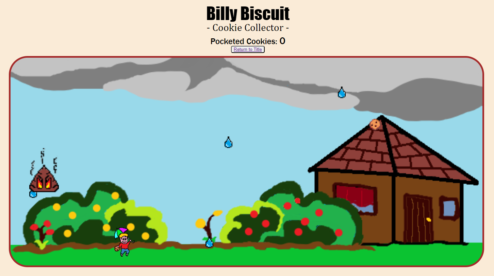

# Billy Biscuit -Cookie Collector-
Module 01, Week 03, Project 01: Game

## Description
Game built with web technologies (HTML, CSS, JavaScript).

## How to Play
All necessary information exists on the title screen but to summarize:

Use the LEFT and RIGHT arrow keys to move the player (Billy) horizontally.

Catching (collision / contact) with certain elements increases points, while doing the same with other elements decreases points.

Reaching zero points ends the game in defeat, and reaching a certain maximum ends the game in victory.

## Work in Progress
### Fix:
- [X]    objects properly disappearing when reaching the ground
- [X]    objects properly disappearing when contacting the player
- [ ]   restricting player movement to within the game space
- [ ]   properly aligning/re-aligning elements when viewport sizes differ

### Functionality:
- [X]   implement point counter
- [ ]   make point counter return precise numbers (possibly related to...)
- [ ]   return single instance of collision per element instead of multiple (inflates the point counter)
- [ ]   in-game pop-up notifications
- [ ]   incremental increase in game difficulty (faster sprites, increasing varieties of elements, more frequent spawns, projectiles, etc.)
- [ ]   multiple lives, collectible elements to increase lives

## UX:
- [ ]   beautifying game menus, including proper positioning of static elements, etc.
- [ ]   background music and sound effects

## Code:
- [ ]   create a Game class
- [ ]   improve the interaction between current parent-child classes
- [ ]   try to store the different triggers and/or conditions of the different sprites and player inside an object structure
- [ ]   streamline the functions to encompass more conditions and variables in fewer functions instead of writing multiple similar functions for different elements