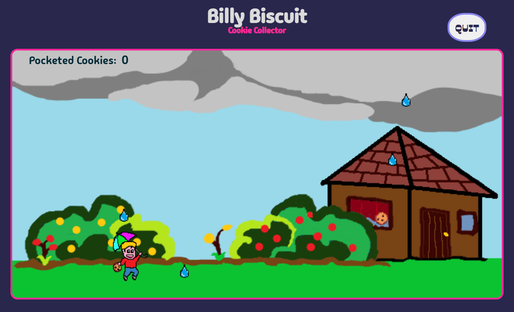
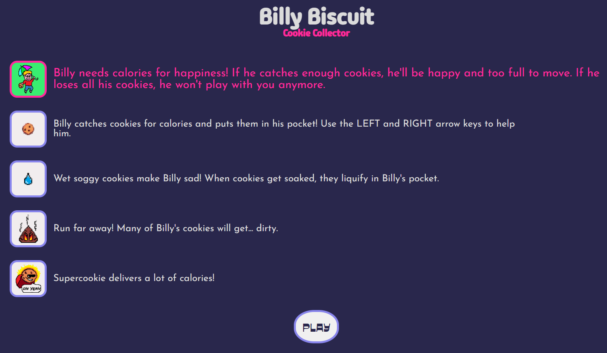

# Billy Biscuit: Cookie Collector
#### Module 01, Week 03, Project 01
## Browser Game

## Technologies Used
- HTML
- CSS (vanilla)
- JavaScript
    - objects
    - classes
    - collision detection

- Images and sprites made by me on Microsoft Paint and Paint 3D

## How to Play

## Demo
[Play the game here](https://mqzmcs.github.io/project01game/)

## Work in Progress
### Fix:
- [X]   objects properly disappearing when reaching the ground
- [X]   objects properly disappearing when contacting the player
- [ ]   restricting player movement to within the game space

### Functionality:
- [X]   implement point counter
- [ ]   make point counter return precise numbers (possibly related to...)
- [ ]   return single instance of collision per element instead of multiple (inflates the point counter)

## UX:
- [X]   beautifying game menus, including proper positioning of static elements, etc.
- [ ]   background music and sound effects

## Code:
- [ ]   create a Game class
- [ ]   improve the interaction between current parent-child classes
- [ ]   try to store the different triggers and/or conditions of the different sprites and player inside an object structure
- [ ]   streamline the functions to encompass more conditions and variables in fewer functions instead of writing multiple similar functions for different elements